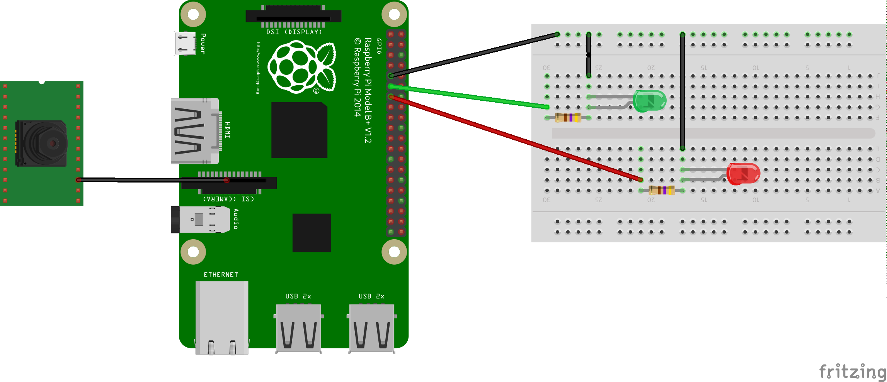

# Inference with TFLite on Edge devices

This example walks through how to deploy a [TFLite model](https://www.tensorflow.org/lite/guide) in an edge device using [Seldon Core](https://github.com/SeldonIO/seldon-core/).
In particular, we will deploy a face mask detector in a Raspberry Pi, which will run inference locally from a camera feed.



The face mask detector has already been pre-trained by the team at [Aizoo Tech team](https://aizoo.com) who has kindly put it available on the [AIZOOTech/FaceMaskDetection](https://github.com/AIZOOTech/FaceMaskDetection) repository. **Massive thanks to them!**


## Pre-requisites

### Kubernetes Cluster

The example assumes that there is a Kubernetes cluster already created, accessible through `kubectl`. 
If you don't have one, you can use [Kind](https://github.com/kubernetes-sigs/kind) to create one locally.

#### Seldon Core

The example assumes that Seldon Core has already been installed in the cluster.
If it hasn't, you can follow the [setup instructions in the Seldon Core documentation](https://docs.seldon.io/projects/seldon-core/en/latest/workflow/install.html).

It's also worth noting that some steps below assume that Seldon Core has been installed using Helm with name `seldon-core` in the `seldon-system` namespace.
This is not a hard requirement though, and it should be simple to adapt those steps in case it has been installed in a different location.

#### KubeEdge

The example assumes that KubeEdge has already been installed in the cluster, exposing the `cloudcore` component so that it's accessible from an edge device.

### Edge Device

The example assumes that the edge device is a Raspberry Pi with an ARMv7 architecture of 32 bits.
In particular, the example has been tested with a Raspberry Pi 3 Model B V1.2.
We will assume that this device has been pre-synced through KubeEdge and that it's already visible as a node in the cluster with name `raspberry`. 

The example also requires that the Raspberry Pi has a camera module attached.

## TFLite Inference Server

Out of the box, Seldon Core doesn't offer support for TFLite models (particularly under an ARM architecture).
However, as we shall see, it's fairly simple to leverage their support for [custom inference servers](https://docs.seldon.io/projects/seldon-core/en/latest/servers/custom.html).

### Implementing Model Runtime

Firstly, we'll extend the `SeldonComponent` interface to create a new model runtime.
The methods that we'll want to extend are:

- `load()`: responsible for loading our TFLite model
- `predict()`: responsible for running inference against our model

Note that we also want to parametrise the following model-specific details:

- Where are model weights loaded from (i.e. `model_uri`).
- On which tensor should we load the input data (i.e. `input_tensor_name`).
- From which tensor should we read the model's output (i.e. `output_tensor_name`).


```python
%%writefile ./tfliteserver/TFLiteServer.py
import os
import glob
import numpy as np

from seldon_core.user_model import SeldonComponent
from tflite_runtime import interpreter as tflite
from typing import List, Dict, Iterable

TFLITE_EXT = "*.tflite"


class TFLiteServer(SeldonComponent):
    def __init__(
        self,
        model_uri: str,
        input_tensor_name: str,
        output_tensor_name: str,
    ):
        self._model_uri = model_uri
        self._input_tensor_name = input_tensor_name
        self._output_tensor_name = output_tensor_name

    def load(self):
        model_path = self._get_model_path()
        self._interpreter = tflite.Interpreter(model_path=model_path)
        self._interpreter.allocate_tensors()

        # Obtain input tensor index
        input_tensors = self._interpreter.get_input_details()
        self._input_tensor_index = self._get_tensor_index(
            input_tensors, self._input_tensor_name
        )

        # Obtain output tensor index
        output_tensors = self._interpreter.get_output_details()
        self._output_tensor_index = self._get_tensor_index(
            output_tensors, self._output_tensor_name
        )

    def _get_model_path(self) -> str:
        # Search for *.tflite files to load
        pattern = os.path.join(self._model_uri, TFLITE_EXT)
        model_paths = glob.glob(pattern)
        if not model_paths:
            raise RuntimeError(f"No models found at {self._model_uri}")

        return model_paths[0]

    def _get_tensor_index(self, tensors: List[Dict], tensor_name: str) -> int:
        for tensor in tensors:
            if tensor["name"] == tensor_name:
                return tensor["index"]

        raise RuntimeError(f"Tensor name not found: {tensor_name}")

    def predict(self, X: np.ndarray, names: Iterable[str], meta: Dict = None):
        # Force input to be np.float32
        img = np.float32(X)

        # NOTE: This is not thread-safe!
        self._interpreter.set_tensor(self._input_tensor_index, img)
        self._interpreter.invoke()

        output = self._interpreter.get_tensor(self._output_tensor_index)

        return output

```

### Containerise Model Runtime

The next step will be building our runtime into a Docker image.
It's worth mentioning that the new image has to be compatible with an ARM architecture, therefore we won't be able to use the [`s2i` facilities provided by Seldon Core](https://docs.seldon.io/projects/seldon-core/en/latest/python/python_wrapping_s2i.html) out of the box.
However, we can put up a together a `Dockerfile` based on [Seldon's documentation to wrap models using Docker directly](https://docs.seldon.io/projects/seldon-core/en/latest/python/python_wrapping_docker.html).


```python
%%writefile ./tfliteserver/Dockerfile
FROM arm32v7/python:3.7.8-slim

WORKDIR /usr/src/app

ENV API_TYPE="REST"
ENV SERVICE_TYPE="MODEL"

# Install native subdeps of Python deps.
# - `libatlas`: necessary for `numpy`
# - `libatomic1`: necessary for `grpcio`
RUN apt-get update \
    && apt-get install -y libatlas-base-dev libatomic1

RUN pip install --upgrade wheel setuptools pip

COPY requirements.txt ./
RUN pip install \
    -r requirements.txt \
    --extra-index-url=https://piwheels.org/simple

COPY . .

CMD seldon-core-microservice TFLiteServer $API_TYPE --service-type $SERVICE_TYPE 

```

Note that to build this image, we'll need a host able to build `arm` images.
In Linux, we can achieve this using QEMU.


```python
!docker build \
    ./tfliteserver \
    --platform linux/arm/v7 \
    -t adriangonz/tfliteserver:0.1.0-arm
!docker push adriangonz/tfliteserver:0.1.0-arm
```

### Add new inference runtime to Seldon Core

Lastly, we'll need to configure the new runtime as a [custom inference server within Seldon Core](https://docs.seldon.io/projects/seldon-core/en/latest/servers/custom.html).
Note that Seldon Core allows you to override the image used for your model at the `SeldonDeployment` level, thus **this step is not needed**.
However, it leads to higher reusability.

For our example, we will configure our new runtime under the `TFLITE_SERVER` key, by adding the following to the `predictor_servers` key in the `seldon-config` configmap:

```json
{
     "TFLITE_SERVER": {
         "rest": {
             "defaultImageVersion": "0.1.0-arm",
             "image": "adriangonz/tfliteserver"
         }
     }
}
```

Note that this can be added as part of the values of the Helm chart when installing Seldon Core.
If we assume that the chart has been installed under the `seldon-core` name in the `seldon-system` namespace, we can do:


```python
!helm upgrade seldon-core seldonio/seldon-core-operator \
    -n seldon-system \
    --reuse-values \
    --set 'predictor_servers.TFLITE_SERVER.rest.defaultImageVersion=0.1.0-arm' \
    --set 'predictor_servers.TFLITE_SERVER.rest.image=adriangonz/tfliteserver'
```

## Model Initialiser Image

The model initialiser is part of the Seldon Core architecture.
It's responsible for downloading any model artifacts at init time, which will then be exposed to the actual model deployment.
This functionality is wrapped as a Docker image, which currently only supports the `x86` architecture.

Therefore, to leverage it on our edge deployment, we will need to re-build it using an ARM-compatible base.
You can find a pre-built compatible image under tag `adriangonz/storage-initializer:v0.4.0-arm`.
The only extra steep necessary will be to configure Seldon Core to use this image instead of the default one.

As before, we can do this by changing the `seldon-config` namespace.
We can do this by modifying the values of the Seldon Core Helm chart.
If we assume that the chart has been installed under the `seldon-core` name in the `seldon-system` namespace, we could run:


```python
!helm upgrade seldon-core seldonio/seldon-core-operator \
    -n seldon-system \
    --reuse-values \
    --set 'storageInitializer.image=adriangonz/storage-initializer:v0.4.0-arm'
```

## Deploy model

Now that we've got the different components set up, it should be possible to deploy our model instantiating a `SeldonDeployment` resource.
This resource needs to specify that our machine learning deployment will:

- Leverage the `TFLITE_SERVER` inference server.
- Load the model weights from the [AIZOOTech/FaceMaskDetection repo](https://github.com/AIZOOTech/FaceMaskDetection/raw/master/models/face_mask_detection.tflite).
- Be deployed to the node named `raspberry`, which is an edge device with an ARM architecture.
- Specify that the model input goes into the tensor named `data_1` and the model output comes from the tensor named `cls_branch_concat_1/concat` (these are model-specific details which we've parametrised in out TFLite runtime).

This can be done easily with Seldon Core as:


```python
%%writefile ./charts/seldondeployment-face-mask-detector.yaml
apiVersion: machinelearning.seldon.io/v1
kind: SeldonDeployment
metadata:
  name: face-mask-detector
  namespace: examples
spec:
  predictors:
    - annotations:
        seldon.io/no-engine: "true"
      graph:
        name: model
        implementation: TFLITE_SERVER
        modelUri: 'https://github.com/AIZOOTech/FaceMaskDetection/raw/master/models/face_mask_detection.tflite'
        parameters:
            - name: input_tensor_name
              value: data_1
              type: STRING
            - name: output_tensor_name
              value: cls_branch_concat_1/concat
              type: STRING
        children: []
      componentSpecs:
        - spec:
            nodeName: raspberry
      name: default

```


```python
!kubectl apply -f ./charts/seldondeployment-face-mask-detector.yaml
```

## Camera Reader

The next step in our example is to fetch some images to run inference on.
For that, we will attach a camera module to our edge device through the flex port.
This camera will be used by a new container, which will continously capture frames and run inference on them.

Based on the results of each frame, the same loop will also switch on / off a set of two red and green LEDs to indicate if our model flagged someone as not wearing a mask.

### Implementing Camera Reader

For each frame, the loop will be something like:

- Capture frame from camera
- Send to our model to perform inference
- Process the predicted values

The code for the loop can be seen below:


```python
%%writefile ./camera-reader/camera.py
import logging
import requests
import time
import os
import numpy as np

from gpiozero import LED
from picamera import PiCamera
from picamera.array import PiRGBArray


DEBUG = os.getenv("DEBUG", "false").lower() == "true"
MODEL_IP = os.getenv("MODEL_IP", default="face-mask-detector-default")
MODEL_PORT = os.getenv("MODEL_PORT", default="9001")
MODEL_SERVER = f"http://{MODEL_IP}:{MODEL_PORT}"
PIXEL_FORMAT = "RGB"
CAMERA_RESOLUTION = (260, 260)
CAMERA_WARMUP_SECONDS = 2
CONFIDENCE_THRESHOLD = 0.5

GPIO_GREEN_LED = 17
GPIO_RED_LED = 27

green_led = LED(GPIO_GREEN_LED)
red_led = LED(GPIO_RED_LED)


def _setup_logger():
    log_level = logging.INFO
    if DEBUG:
        log_level = logging.DEBUG
    logging.basicConfig(level=log_level)


def _get_camera() -> PiCamera:
    logging.info(f"Accessing camera with {CAMERA_RESOLUTION} resolution")
    camera = PiCamera()
    camera.resolution = CAMERA_RESOLUTION
    # Start a preview and let the camera warm up for 2 seconds
    logging.info("Waiting for camera to warm up...")
    camera.start_preview()
    time.sleep(CAMERA_WARMUP_SECONDS)

    logging.info("Obtained camera handle!")
    return camera


def _save_frame(frame: np.ndarray):
    pass


def _run_inference(frame: np.ndarray) -> np.ndarray:
    logging.debug(f"Running inference in frame with shape {frame.shape}...")

    # Normalise pixels to [0-1] range
    batch = np.expand_dims(frame, axis=0) / 255.0
    payload = {"data": {"ndarray": batch.tolist()}}
    endpoint = f"{MODEL_SERVER}/api/v1.0/predictions"

    logging.debug(f"Sending request to inference endpoint {endpoint}...")
    response = requests.post(endpoint, json=payload)
    if not response.ok:
        raise RuntimeError("Invalid frame")

    json_response = response.json()
    confidences = np.array(json_response["data"]["ndarray"])
    logging.debug(f"Obtained prediction with shape {confidences.shape}")

    # Filter out low-confidence predictions
    max_confidences = np.max(confidences, axis=2)
    classes = np.argmax(confidences, axis=2)
    high_confidence = np.where(max_confidences > CONFIDENCE_THRESHOLD)

    return classes[high_confidence]


def _update_leds(y_pred: np.ndarray):
    logging.debug("Updating LEDs...")

    without_mask = np.count_nonzero(y_pred)
    with_mask = len(y_pred) - without_mask
    logging.debug(f"Detected {without_mask} persons without mask")
    logging.debug(f"Detected {with_mask} persons with mask")

    if without_mask > 0:
        green_led.off()
        red_led.on()
        return

    if with_mask > 0:
        green_led.on()
        red_led.off()
        return

    green_led.off()
    red_led.off()


def main():
    _setup_logger()
    camera = _get_camera()
    frame = PiRGBArray(camera)

    logging.info("Starting capture loop... Smile!")
    for _ in camera.capture_continuous(frame, PIXEL_FORMAT.lower()):
        if DEBUG:
            _save_frame(frame.array)

        y_pred = _run_inference(frame.array)
        _update_leds(y_pred)
        # Truncate to re-use
        # https://picamera.readthedocs.io/en/release-1.13/api_array.html#pirgbarray
        frame.truncate(0)


if __name__ == "__main__":
    main()
```

### Containerise Camera Reader

As before, we will containerise our code using an ARM-compatible Docker image.


```python
%%writefile ./camera-reader/Dockerfile
FROM arm32v7/python:3.7.8-slim

WORKDIR /usr/src/app

# Install native subdeps of Python deps.
# - `libatlas`: necessary for `numpy`
RUN apt-get update \
    && apt-get install -y libatlas-base-dev

RUN pip install --upgrade wheel setuptools pip

COPY requirements.txt ./
RUN pip install \
    -r requirements.txt \
    --extra-index-url=https://piwheels.org/simple

COPY . .

CMD [ "python", "./camera.py" ]

```


```python
!docker build \
    ./camera-reader \
    --platform linux/arm/v7 \
    -t adriangonz/camera-reader:0.1.0-arm
!docker push adriangonz/camera-reader:0.1.0-arm
```

### Deploy alongside our model

To keep our code self-contained, we will deploy the camera reader as a sidecar container alongside our model.
This means that the **data won't need to exit the Kubernetes pod within our edge device**.
However, note that setup is **optional** and could be architected in a different way (e.g. if the camera was on a completely different device).

To do that, we can leverage the same `SeldonDeployment` as before, including the camera reader as another container in the `componentSpecs`.


```python
%%writefile ./charts/seldondeployment-face-mask-detector-with-camera-reader.yaml
apiVersion: machinelearning.seldon.io/v1
kind: SeldonDeployment
metadata:
  name: face-mask-detector
  namespace: examples
spec:
  predictors:
    - annotations:
        seldon.io/no-engine: "true"
      graph:
        name: model
        implementation: TFLITE_SERVER
        modelUri: "https://github.com/AIZOOTech/FaceMaskDetection/raw/master/models/face_mask_detection.tflite"
        parameters:
          - name: input_tensor_name
            value: data_1
            type: STRING
          - name: output_tensor_name
            value: cls_branch_concat_1/concat
            type: STRING
        children: []
      componentSpecs:
        - spec:
            containers:
              - name: camera-reader
                image: adriangonz/camera-reader:0.1.0-arm
                volumeMounts:
                  - mountPath: /opt/vc
                    name: vc-libs
                  - mountPath: /dev/vchiq
                    name: dev-vchiq
                  - mountPath: /dev/gpiomem
                    name: dev-gpiomem
                securityContext:
                  privileged: true
                  runAsUser: 0
                env:
                  - name: MODEL_IP
                    valueFrom:
                      fieldRef:
                        fieldPath: status.podIP
                  - name: MODEL_PORT
                    value: '9001'
                  - name: DEBUG
                    value: 'true'
                  - name: LD_LIBRARY_PATH
                    value: /opt/vc/lib
            volumes:
              # Native libraries to access the camera
              - name: vc-libs
                hostPath:
                  path: /opt/vc
              # Camera device (requires privileged)
              - name: dev-vchiq
                hostPath:
                  path: /dev/vchiq
              # GPIO pins (requires privileged)
              - name: dev-gpiomem
                hostPath:
                  path: /dev/gpiomem

            nodeName: raspberry
      name: default
```


```python
!kubectl apply -f ./charts/seldondeployment-face-mask-detector-with-camera-reader.yaml
```


```python

```
