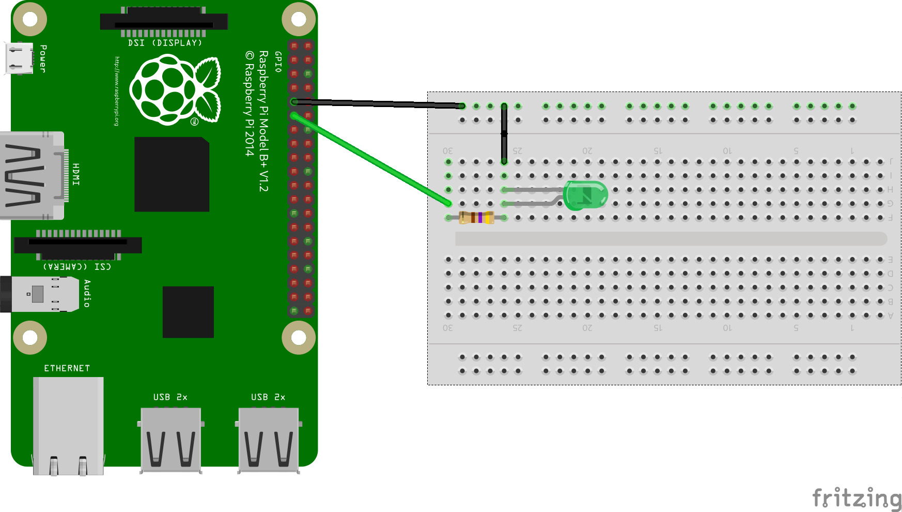

# Controlling a LED through KubeEdge

This example walks through how to control a LED hooked to a Raspberry Pi, via a Kubernetes pod deployed through KubeEdge.



## Pre-requisites

### Kubernetes Cluster

The example assumes that there is a Kubernetes cluster already created, accessible through `kubectl`. 
If you don't have one, you can use [Kind](https://github.com/kubernetes-sigs/kind) to create one locally.

#### KubeEdge

The example assumes that KubeEdge has already been installed in the cluster, exposing the `cloudcore` component so that it's accessible from an edge device.

### Edge Device

The example assumes that the edge device is a Raspberry Pi with an ARMv7 architecture of 32 bits.
In particular, the example has been tested with a Raspberry Pi 3 Model B V1.2.
We will assume that this device has been pre-synced through KubeEdge and that it's already visible as a node in the cluster with name `raspberry`. 

The example also requires that the Raspberry Pi has a LED attached as the diagram shown above.

## LED Blinker

We will leverage the `gpiozero` library to implement a quick script which makes the attached LED blink.
Then, we will containerise it and deploy it to our `raspberry` node leveraging KubeEdge.

### Implementation

The code itself is very simple.
It will make the led blink every second.


```python
%%writefile led.py
from gpiozero import LED
from time import sleep

led = LED(17)

while True:
    led.on()
    sleep(1)
    led.off()
    sleep(1)
```

### Containerisation

The next step will be containerising this example as a Docker image which can be deployed later.
Note that this image needs to be compatible with the ARM architecture of the Raspberry Pi.

For that, we will leverage the `arm32v7/python` image as base.


```python
%%writefile Dockerfile
FROM arm32v7/python:3.7.8-slim

WORKDIR /usr/src/app

COPY requirements.txt ./
RUN pip install -r requirements.txt

COPY . .

CMD [ "python", "./led.py" ]
```


```python
!docker build \
    . \
    --platform linux/arm/v7 \
    -t adriangonz/kubeedge-led-example:0.1.0-arm
!docker push adriangonz/kubeedge-led-example:0.1.0-arm
```

### Deployment

The last step is to create a `Pod` which runs our `led.py` script.

It's worth noting that this pod needs privileged access to the `/dev/gpiomem` file, which maps the GPIO board in the Raspberry Pi.
We can achieve this by leveraging Kubernetes volumes support.


```python
%%writefile ./charts/pod-led-example.yaml
apiVersion: v1
kind: Pod
metadata:
  name: led-example
  namespace: examples
spec:
  containers:
    - name: led-example
      image: adriangonz/kubeedge-led-example:0.1.0-arm
      volumeMounts:
        - mountPath: /dev/gpiomem
          name: dev-gpiomem
      securityContext:
        privileged: true
  volumes:
    - name: dev-gpiomem
      hostPath:
        path: /dev/gpiomem
  nodeName: raspberry
```

Note that the Pod definition is standard Kubernetes.
Once we've got it, we can simply deploy it using `kubectl` as any regular resource.


```python
!kubectl apply -f ./charts/pod-led-example.yaml
```


```python

```
